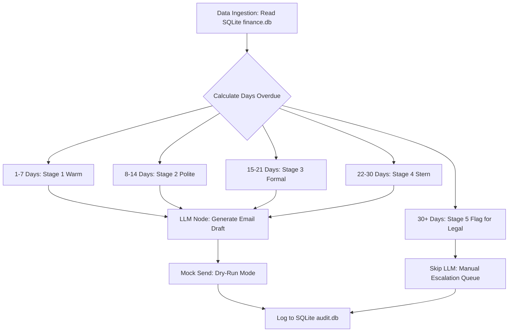

# Finance Credit Follow-Up Email Agent

## 1. Project Overview
The **Finance Credit Follow-Up Email Agent** is an autonomous AI prototype designed to support finance teams by automating the process of chasing overdue invoice payments. 

Manual follow-ups are often inconsistent in tone and timing, creating a massive drain on resources. This agent solves that business problem by automatically ingesting pending credit records, calculating the exact number of days overdue, and mapping that delinquency to a strict **Tone Escalation Matrix**. Using Google's Gemini LLM, the agent drafts highly personalized, professional emails that dynamically shift in tone—starting with a "Warm & Friendly" reminder and escalating to a "Stern & Urgent" final notice. 

It features a built-in cap that flags severely overdue accounts for manual legal review, and it logs every single interaction into a local SQLite database for complete auditability, ultimately reducing DSO (Days Sales Outstanding) while preserving client relationships.

---

## 2. Setup Instructions

### Prerequisites
- Python 3.10+
- A Google Gemini API Key

### Installation & Execution
1. **Clone the repository:**
   ```bash
   git clone https://github.com/sinthiagupta/travelCorp.git
   cd travelCorp
   ```
2. **Install dependencies:**
   ```bash
   pip install -r requirements.txt
   ```
3. **Configure Environment Variables:**
   Create a `.env` file in the root directory (refer to `.env.example`) and add your API key:
   ```env
   GEMINI_API_KEY=your_api_key_here
   LANGCHAIN_TRACING_V2=true # Optional: For LangSmith observability
   ```
4. **Initialize the Database:**
   ```bash
   python finance_agent/database.py
   ```
   *(This creates the local `finance.db` for mock data and `audit.db` for the interaction logs).*
5. **Launch the Agent Dashboard:**
   ```bash
   python -m streamlit run finance_agent/dashboard.py
   ```

---

## 3. Agent Architecture Diagram



---

## 4. Technical Stack & Decision Log

| Disclosure | Selection & Rationale |
| :--- | :--- |
| **LLM Chosen** | **Gemini 1.5 Flash**. Chosen for its high-speed inference, excellent instruction following for structural templates, and native support for structured output (JSON/Pydantic parsing) which is critical for preventing hallucination. |
| **Agent Framework** | **LangGraph**. Chosen over standard LangChain because the follow-up process is highly stateful and deterministic. LangGraph allows us to define rigid nodes (Routing -> LLM -> Action) and ensure the agent strictly follows the Escalation Matrix without deviating. |
| **Prompt Design** | Transitioned from a Zero-Shot prompt to **Dynamic State-Driven Templating**. We mapped specific CTA instructions (`TONE_CTA`) in Python and only injected the relevant rule into the prompt. Furthermore, we enforced strict spatial boundaries (requiring `\n\n` newlines) and utilized `with_structured_output(EmailResponse)` to force the LLM to return reliable JSON objects instead of raw text. See `prompt_history.md` for the full iteration log. |
| **Data Source** | **SQLite (SQLAlchemy)**. Chosen for local, serverless execution to ensure no PII leaves the host machine during the data ingestion phase. |
| **UI Dashboard** | **Streamlit**. Provides a clean, real-time "Master-Detail" view allowing human operators to monitor the pending queue and review the AI-generated emails in the audit archive. |

---

## 5. Security & Risk Mitigation

Security is a primary design constraint for this agent. The following mitigations have been implemented to protect data privacy and ensure systemic reliability:

| Risk | Mitigation Strategy Implemented |
| :--- | :--- |
| **Prompt Injection** | **Structured Output Validation:** The LLM is wrapped in LangChain's `with_structured_output` using Pydantic schemas (`EmailResponse`). The system physically cannot execute malicious code because it expects strict JSON keys (`subject` and `body`). |
| **Data Privacy / PII** | **Local Processing Sandbox:** All client names, invoice numbers, and financial data are stored in a local `.db` file. We do not use cloud vector databases, and the system relies entirely on ephemeral memory during generation. |
| **API Key Exposure** | **Environment Secrets:** All keys are managed via `python-dotenv`. The `.env` file is strictly ignored via `.gitignore`. A sanitized `.env.example` is provided for repository integrity. |
| **Hallucination Risk** | **Dynamic Prompt Constraints:** By moving the tone logic out of the prompt and into Python (LangGraph routing), we prevent the LLM from hallucinating the escalation stage. The LLM only receives the exact data it needs to weave into the paragraph, preventing fabricated facts. |
| **Email Spoofing / Accidental Send** | **Dry-Run Sandbox Mode:** The agent operates strictly in "Mock Send" mode. There are no active SMTP credentials or Mailgun APIs connected. The output is routed directly to the Streamlit UI and local `audit.db` to guarantee real clients are not accidentally emailed during testing. |