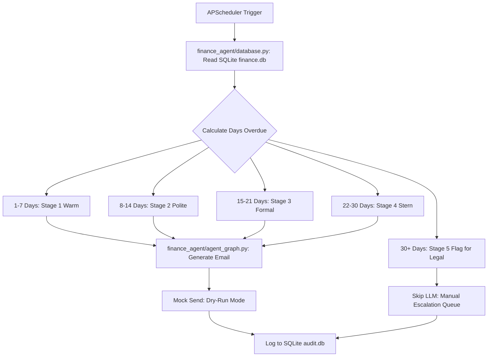

# Finance Credit Follow-Up Email Agent

## 1. Project Overview
The **Finance Credit Follow-Up Email Agent** is an autonomous AI prototype designed to support finance teams by automating the process of chasing overdue invoice payments. 

Manual follow-ups are often inconsistent in tone and timing, creating a massive drain on resources. This agent solves that business problem by automatically ingesting pending credit records, calculating the exact number of days overdue, and mapping that delinquency to a strict **Tone Escalation Matrix**. Using Google's **gemini-2.5-flash** LLM, the agent drafts highly personalized, professional emails that dynamically shift in tone—starting with a "Warm & Friendly" reminder and escalating to a "Stern & Urgent" final notice. 

It features a built-in cap that flags severely overdue accounts for manual legal review, and it logs every single interaction into a local SQLite database for complete auditability. It runs entirely autonomously on a scheduled background interval using APScheduler, ultimately reducing DSO (Days Sales Outstanding) while preserving client relationships.

---

## 2. Project Structure
The core logic of the application is modularized into three primary Python files within the `finance_agent/` directory:
- `database.py`: Handles all SQLite operations, initializing `finance.db` (mock invoices) and `audit.db` (logging emails and escalation statuses).
- `agent_graph.py`: The brain of the operation. It uses LangGraph to orchestrate the pipeline (Data Ingestion -> Tone Assignment -> LLM Generation), integrating LangChain with Gemini to build strict structural email templates. It utilizes `APScheduler` to run autonomously in the background, and implements an `SQLiteCache` (`langchain_cache.db`) to reduce redundant API calls.
- `dashboard.py`: A Streamlit user interface that provides a "Master-Detail" real-time view of pending invoices and an interactive archive of AI-generated emails.

---

## 3. Setup Instructions

### Prerequisites
- Python 3.10+
- A Google Gemini API Key
- A LangSmith API Key (for observability)

### Installation & Execution
1. **Clone the repository:**
   ```bash
   git clone https://github.com/sinthiagupta/travelCorp.git
   cd travelCorp
   ```
2. **Install dependencies:**
   ```bash
   pip install -r requirements.txt
   ```
3. **Configure Environment Variables:**
   Create a `.env` file in the root directory (matching the provided `.env.example`) and add your API keys:
   ```env
   GEMINI_API_KEY=your_gemini_key_here
   LANGCHAIN_TRACING_V2=true
   LANGCHAIN_API_KEY=your_langsmith_key_here
   ```
4. **Initialize the Database:**
   ```bash
   python finance_agent/database.py
   ```
   *(This creates the local `finance.db` and `audit.db` databases).*
5. **Launch the Agent Dashboard:**
   ```bash
   python -m streamlit run finance_agent/dashboard.py
   ```

---

## 4. Agent Architecture Diagram



---

## 5. Technical Stack & Decision Log

| Component | Selection & Rationale |
| :--- | :--- |
| **LLM Chosen** | **Gemini 2.5 Flash** (`gemini-2.5-flash`). Chosen for its blazing-fast inference speed, cost-effectiveness, and excellent instruction following for structural templates. It perfectly handles native structured outputs (JSON/Pydantic) preventing generation errors. |
| **Agent Framework** | **LangGraph**. Chosen over standard LangChain because the follow-up process is highly stateful and deterministic. LangGraph allows us to define rigid nodes (Routing -> LLM -> Action) and ensure the agent strictly follows the Escalation Matrix. |
| **Scheduling Engine** | **APScheduler** (`BlockingScheduler`). Used to simulate a production `cron` trigger that dispatches the LangGraph agent autonomously at scheduled intervals, entirely removing the need for human initiation. |
| **Observability & Tracing** | **LangSmith**. Fully integrated via `LANGCHAIN_TRACING_V2` to capture all LLM runs, token usage, latency metrics, and execution traces. This provides enterprise-grade debugging capabilities and visibility into the agent's thought process. |
| **Prompt Design** | Transitioned from a Zero-Shot prompt to **Dynamic State-Driven Templating**. We mapped specific CTA instructions (`TONE_CTA`) in Python and only injected the relevant rule into the prompt. Furthermore, we enforced strict spatial boundaries (requiring `\n\n` newlines) and utilized LangChain's `with_structured_output` to force the LLM to return reliable JSON objects. See `finance_agent/prompt_history.md` for the full iteration log. |
| **Data Source** | **SQLite (SQLAlchemy)**. Chosen for local, serverless execution to ensure no PII leaves the host machine during ingestion. Caching is also handled locally via `langchain_cache.db`. |
| **UI Dashboard** | **Streamlit**. Provides a clean, real-time "Master-Detail" view allowing human operators to monitor the pending queue and review the AI-generated emails safely. |

---

## 6. Security & Risk Mitigation

Security is a primary design constraint for this agent. The following mitigations have been implemented to protect data privacy and ensure systemic reliability:

| Risk | Mitigation Strategy Implemented |
| :--- | :--- |
| **Prompt Injection** | **Structured Output Validation:** The LLM is wrapped in LangChain's `with_structured_output` using Pydantic schemas (`EmailResponse`). The system physically cannot execute malicious code because it expects strict JSON keys (`subject` and `body`). |
| **Data Privacy / PII** | **Local Processing Sandbox:** All client names, invoice numbers, and financial data are stored securely in local SQLite `.db` files. We do not use cloud vector databases, and the system relies entirely on ephemeral memory during generation. |
| **API Key Exposure** | **Environment Secrets:** All keys (Gemini, LangChain) are managed via `python-dotenv`. The `.env` file is strictly ignored via `.gitignore` alongside all cache and `.db` files. |
| **Hallucination Risk** | **Dynamic Prompt Constraints:** By moving the tone logic out of the prompt and into Python (LangGraph routing), we prevent the LLM from hallucinating the escalation stage. The LLM only receives the exact data it needs to weave into the paragraph, preventing fabricated facts. |
| **Email Spoofing / Accidental Send** | **Dry-Run Sandbox Mode:** The agent operates strictly in "Mock Send" mode. There are no active SMTP credentials or APIs connected. The output is routed directly to the Streamlit UI and local `audit.db` to guarantee real clients are not accidentally emailed during testing. |